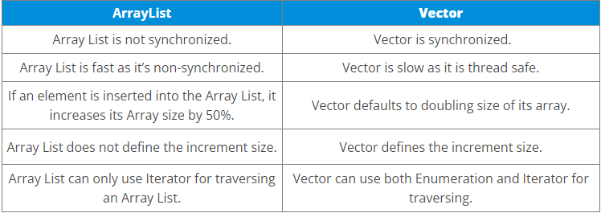
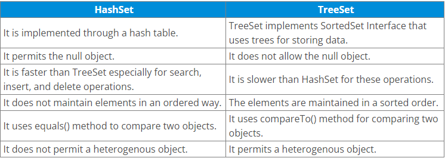
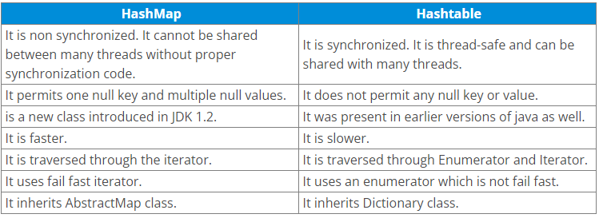
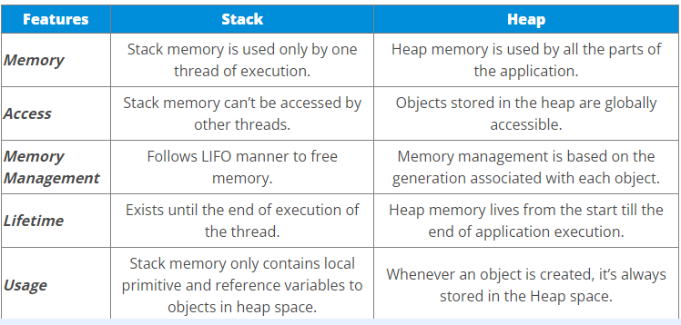
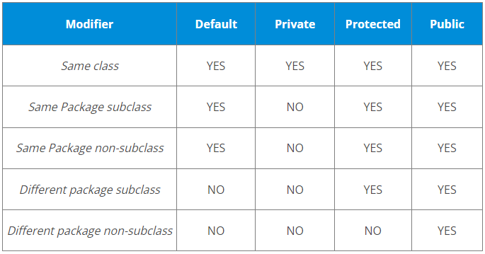
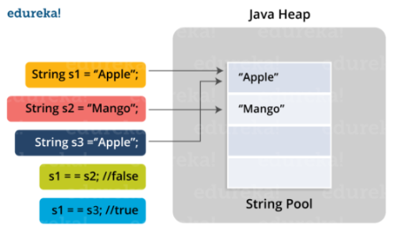

# Interview Questions

1) What are wrapper classes in Java?
    
    Wrapper classes convert the Java primitives into the reference types (objects). Every primitive data type has a class dedicated to it. These are known as wrapper classes because they “wrap” the primitive data type into an object of that class

2) What is singleton class in Java and how can we make a class singleton?

    Singleton class is a class whose only one instance can be created at any given time, in one JVM. A class can be made singleton by making its constructor private.

3) What is the difference between Array list and vector in Java?

   

4) When can you use the super keyword?

    In Java, the super keyword is a reference variable that refers to an immediate parent class object.
    When you create a subclass instance, you’re also creating an instance of the parent class, which is referenced to by the super reference variable.
    
    The uses of the Java super Keyword are- 
    
        1. To refer to an immediate parent class instance variable, use super.
        
        2. The keyword super can be used to call the method of an immediate parent class.
        
        3. Super() can be used to call the constructor of the immediate parent class.

5) What makes a HashSet different from a TreeSet?

    
    
6) What are the differences between HashMap and HashTable in Java?

    
    
7) How is the creation of a String using new() different from that of a literal?

    When we create a string using new(), a new object is created. Whereas, if we create a string using the string literal syntax, it may return an already existing object with the same name.

8) Why is synchronization necessary? Explain with the help of a relevant example?

    Java allows multiple threads to execute. They may be accessing the same variable or object. Synchronization helps to execute threads one after another.
    It is important as it helps to execute all concurrent threads while being in sync. It prevents memory consistency errors due to access to shared memory. An example of synchronization code is-
      
        public synchronized void increment()
        {
        a++;
        } 
     
     As we have synchronized this function, this thread can only use the object after the previous thread has used it.

9) What are the differences between Heap and Stack Memory in Java?

    

10) What are access modifiers in Java?

    In Java, access modifiers are special keywords which are used to restrict the access of a class, constructor, data member and method in another class. Java supports four types of access modifiers:
        `Default, Private, Protected, Public`
         
    
    
11) What is final keyword in Java?

    final is a special keyword in Java that is used as a non-access modifier. A final variable can be used in different contexts such as:
    
    1. final variable : When the final keyword is used with a variable then its value can’t be changed once assigned. In case the no value has been assigned to the final variable then using only the class constructor a value can be assigned to it.
    
    2. final method : When a method is declared final then it can’t be overridden by the inheriting class.
       
    3. final class : When a class is declared as final in Java, it can’t be extended by any subclass class but it can extend other class.

12) What is Java String Pool?

    Java String pool refers to a collection of Strings which are stored in heap memory. In this, whenever a new object is created, String pool first checks whether the object is already present in the pool or not. If it is present, then the same reference is returned to the variable else new object will be created in the String pool and the respective reference will be returned.
    
    
    
    
13) What are microservices? What is better microservices or monolith?

14) What are some of the annotations used in the sping boot at class level?

    @Component – Identifies a Java Class that is to be registered as a Spring Bean
    
    @Controller or @RestController – Web Layer services like mapping HTTP request to handler methods and processing response
    
    @Repository – Vendor neutral Exception Translation Service on DAO Classes – DataAcessException
    
    @Configuration – Java based configuration/code representing a factory to create Spring beans
    
    @Service – does nothing special, What? I’m confused!

15) How to deploy spring boot application in tomcat?

    Whenever you will create your spring boot application and run it, Spring boot will automatically detect the embedded tomcat server and deploy your application on tomcat.
    After successful execution of your application, you will be able to launch your rest endpoints and get a response.

16) What is auto configuration in spring boot?

    AutoConfiguration is a process by which Spring Boot automatically configures all the infrastructural beans. It declares the built-in beans/objects of the spring specific module such as JPA, spring security and so on based on the dependencies present in your applications class path.

17) What are the @RequestMapping and @RestController annotation in Spring Boot used for?

    The @RequestMapping annotation can be used at class-level or method level in your controller class.
    
    The global request path that needs to be mapped on a controller class can be done by using @RequestMapping at class-level. If you need to map a particular request specifically to some method level.
    
    Below is a simple example to refer to:
    
        @RestController
        @RequestMapping("/greatLearning")
        public class GreatLearningController {
        @RequestMapping("/")
        String greatLearning(){
        return "Hello from greatLearning ";
        }
        @RequestMapping("/welcome")
        String welcome(){
        return "Welcome from GreatLearning";
        }
        }
        
    The @RestController annotation is used at the class level.
    
    You can use @RestController when you need to use that class as a request handler class.All the requests can be mapped and handled in this class.
    
    @RestController itself consists @Controller and @ResponseBody which helps us to remove the need of annotating every method with @ResponseBody annotation.

18) Java code to find the second highest salary?

        SELECT salary 
        FROM employee 
        ORDER BY salary desc limit n-1,1
