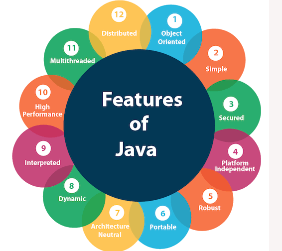

# JAVA

## Features of java

   
    
                      
## Pre-requisites for development, JDK & JRE Structure 
    
   
      
            
## Structure of a java program
 
   

## Sample Code Example 

        import java.util.*;
        import java.lang.*;
        import java.io.*;
        
        class HelloWorld {
            public static void main(String[] args) {
              System.out.println("Hello World......");
              Scanner scanner = new Scanner(System.in);
              System.out.println("Enter the value");
              int value = scanner.nextInt();
              System.out.println("Entered value\t"+value);
            }  
        }
    
## Variable Declaration and Initialization

   1. Variables are used to represent values that may be changed in the program. In Java, all variables must be declared before they can be used,
     
        The basic form of a variable declaration is shown here:
        
        `type identifier [ = value][, identifier [= value] ...] ;`
        
        
        
        Types of variables in with respective data types,
        
        

## Object Reference

   1. Object references do not hold the value of the object they refer to
    
   2. They point to an object by storing the memory address where the object is located
    
   3. A reference variable has a “handle” to an object that allows you access to that object’s attributes. 
    
   4. The default value of all object references is null. A reference can be assigned to another object of the same type or to a new object using the new keyword.

## Java Arrays

   1. It is an object which contains elements of a similar data type
    
   2. Additionally, The elements of an array are stored in a `contiguous memory location(consecutive addresses)`
    
   3. We can store only a fixed set of elements in a Java array.
    
       
    
   4. Advantages
        
        Code Optimization: It makes the code optimized, we can retrieve or sort the data efficiently.
        
        Random access: We can get any data located at an index position.
    
   5. Disadvantages
        
        Size Limit: We can store only the fixed size of elements in the array. 
        
        It doesn't grow its size at runtime. To solve this problem, collection framework is used in Java which grows automatically.

   6. There are two types of array.
       
          1. Single Dimensional Array
          
                    //Syntax
                    dataType[] arr; (or)  
                    dataType []arr; (or)  
                    dataType arr[];
                    //initiation
                    arrayRefVar=new datatype[size];
                       
          2. Multidimensional Array
          
                    //Syantax
                    dataType[][] arrayRefVar; (or)  
                    dataType [][]arrayRefVar; (or)  
                    dataType arrayRefVar[][]; (or)  
                    dataType []arrayRefVar[]; 
                    //Intantiate
                    int[][] arr=new int[3][3];//3 row and 3 column
                    

## Control Flow in Java/Control Statements in Java

   1. Java compiler executes the code from top to bottom. The statements in the code are executed according to the order in which they appear
   
   2. However, Java provides statements that can be used to control the flow of Java code and such statements are called `control flow statements`

   3. Java provides three types of control flow statements.
   
        1. Decision Making statements
            
                if statements
                switch statement
            
        2. Loop statements
            
                do while loop
                while loop
                for loop
                for-each loop
            
        3. Jump statements
            
                break statement
                continue statement

## Object Oriented Programming
     
   1. Everything in java is considered as an object. The OOPs concepts are followed as well,
        
        1. **Object**: An `entity` that has `state, behavior and identity`, is known as an object e.g., chair, bike, marker, pen, table, car, etc. It can be physical or logical (tangible and intangible).
        
        2. **Class**: A class is a group of objects which have common properties. It is a `template or blueprint` from which objects are created. It is a logical entity. It can't be physical.
        **It contains**: `Fields, Methods, Constructors, Blocks, Nested Class and interfaces`
        
        3. **Packages**: A java package is a group of similar types of classes, interfaces and sub-packages.
                     
            Package in java can be categorized in two form, `built-in package` and `user-defined package`.
                     
            There are many built-in packages such as java, lang, awt, javax, swing, net, io, util, sql etc.
                    
            
        
        4. **Inheritance**: It is a `mechanism` one object acquires all the features of the parent object, It represents the `IS-A relationship` which is nothing but a simple parent-child relationship,
        
            _Why?_ For the case of `method overriding during runtime` and also for `maximum reusable code`
           
            Types of Inheritance: `Single, Multi-level, Hierarchial, Multiple(not supported in java)`
 
           **Aggregation**:If a class have an entity reference, it is known as Aggregation. Aggregation represents `HAS-A relationship`
         
        5. **Polymorphism** : Polymorphism in Java is a `concept` by which we can perform a single action in different ways,
        
             1. Method Overloading(Compile time polymorphism) in Java: If a class has multiple methods having same name but different in parameters, It is also known as
             
                    //changing no. of arguments
                    class Adder{  
                    static int add(int a,int b){return a+b;}  
                    static int add(int a,int b,int c){return a+b+c;}  
                    } 
                     
                    class TestOverloading1{  
                    public static void main(String[] args){  
                    System.out.println(Adder.add(11,11));  
                    System.out.println(Adder.add(11,11,11));  
                    }}
                    
                    
                    //changing data type of arguments
                    class Adder{  
                    static int add(int a, int b){return a+b;}  
                    static double add(double a, double b){return a+b;}  
                    }  
                    class TestOverloading2{  
                    public static void main(String[] args){  
                    System.out.println(Adder.add(11,11));  
                    System.out.println(Adder.add(12.3,12.6));  
                    }}  
                    
             2. Method Overriding(Run Time Polymorphism) in Java: If a subclass provides the specific implementation of the method that has been declared by one of its parent class
                  
                      Rules for Java Method Overriding
                       1. The method must have the same name as in the parent class
                       2. The method must have the same parameter as in the parent class.
                       3. There must be an IS-A relationship (inheritance).
                 
              A real example of Java Method Overriding, Consider a scenario where Bank is a class that provides functionality to get the rate of interest. However, the rate of interest varies according to banks. For example, SBI, ICICI and AXIS banks could provide 8%, 7%, and 9% rate of interest.
              
              
              
        6. **Abstraction**  : It is a `process of hiding` the implementation details and showing only functionality to the user,
          
             There are two ways to achieve abstraction in java
            
                1. Abstract class (0 to 100%)
                
                2. Interface (100%)
                
        7. **Encapsulation**: Encapsulation in Java is a `process of wrapping code and data together` into a single unit,
         e.g., a capsule which is mixed of several medicines.

## Exception Handling in Java
 
   - The Exception Handling in Java is one of the powerful mechanism to handle the runtime errors so that the normal flow of the application can be maintained.
    
   - Hierarchy: The java.lang.Throwable class is the root class of Java Exception hierarchy inherited by two subclasses: Exception and Error. The hierarchy of Java Exception classes is given below:
   
   

   - Types of exceptions: 
   
        

        1) Checked Exception: The classes that directly inherit the Throwable class except RuntimeException and Error are known as checked exceptions. For example, IOException, SQLException, etc. Checked exceptions are checked at compile-time.
        
        2) Unchecked Exception: The classes that inherit the RuntimeException are known as unchecked exceptions. For example, ArithmeticException, NullPointerException, ArrayIndexOutOfBoundsException, etc. Unchecked exceptions are not checked at compile-time, but they are checked at runtime.
        
        3) Error: Error is irrecoverable. Some example of errors are OutOfMemoryError, VirtualMachineError, AssertionError etc.
        
   - Java Exception Keywords: 
   
      1. try: The "try" keyword is used to specify a block where we should place an exception code. It means we can't use try block alone. The try block must be followed by either catch or finally
      
      2. catch: The "catch" block is used to handle the exception. It must be preceded by try block which means we can't use catch block alone. It can be followed by finally block later
      
      3. finally: 	The "finally" block is used to execute the necessary code of the program. It is executed whether an exception is handled or not
      
      4. throw: The "throw" keyword is used to throw an exception
      
      5. throws: The "throws" keyword is used to declare exceptions. It specifies that there may occur an exception in the method. It doesn't throw an exception. It is always used with method signature.
      
   - Java Custom Exception:
   
        We can create our own exceptions that are derived classes of the Exception class. Creating our own Exception is known as custom exception or user-defined exception. Basically, Java custom exceptions are used to customize the exception according to user need.

                public class WrongFileNameException extends Exception {  
                    public WrongFileNameException(String errorMessage) {  
                    super(errorMessage);  
                    }  
                }  

## String
